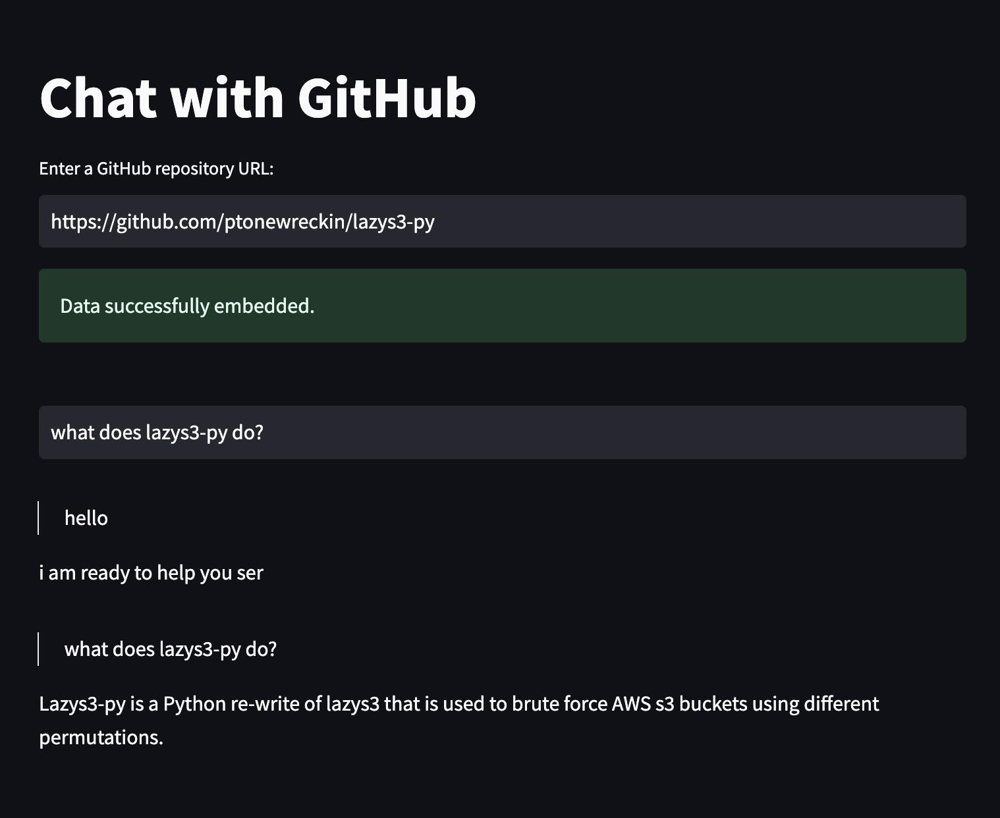

# Chat-with-Github

- This repository enables users to chat with GitHub repositories. The codebase uses OpenAI embeddings, langchain, and a local ChromaDB vectorized database.
- This repository is largely based on the work of:
	- [Chat-with-github-Repo](https://github.com/peterw/Chat-with-Github-Repo)
	- [Chat-with-Github-Repo-Pinecone-version](https://github.com/sai-krishna-msk/Chat-with-Github-Repo-Pinecone-version)

## Usage
- Clone the repository
	- git clone https://github.com/ptonewreckin/Chat-with-GitHub.git
- Install the requirements
	- pip install -r requirements.txt
- Copy .env.example to .env and enter your OPENAI_API_KEY
- streamlit run app.py

# Credits
[Peter](https://github.com/peterw)
[Sai](https://github.com/sai-krishna-msk)

